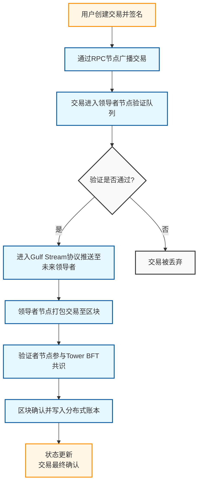
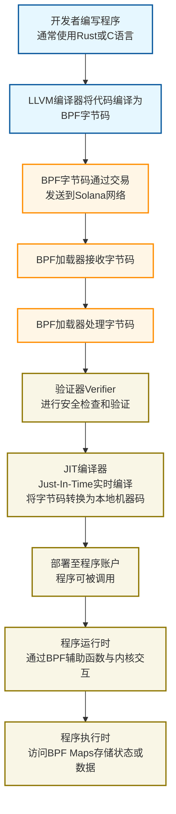

Solana 的交易处理、程序加载和账户模型都很有特色。下面我会通过流程图和对比表格帮你梳理这些知识。

# 🔄 Solana交易生命周期与架构解析

## 1️⃣ Solana交易生命周期流程图

Solana 交易的生命周期主要包含以下几个阶段，下图展示了从交易创建到最终确认的完整流程：

整个流程的核心阶段包括：

-   **交易创建与签名**：用户在钱包（如Phantom）中构造交易内容（如转账、调用智能合约），并使用私钥对交易进行签名。交易包含指令、所需账户列表和签名。
-   **交易广播与传播**：签名后的交易通过Solana RPC节点广播到网络。Solana使用**Turbine协议**将交易数据分解成小块进行传播，以提高吞吐量。
-   **交易验证与排序**：
    -   验证节点（Validators）对收到的交易进行**预验证**，检查签名有效性、账户余额是否充足等。
    -   **历史证明（Proof of History, PoH）** 机制为交易提供全局时间戳和顺序，确保交易的时序一致性。
    -   通过预验证的交易会通过 **Gulf Stream协议**被推送给未来轮次的领导者节点（Leader），从而减少内存池拥堵和确认延迟。
-   **区块打包与共识**：
    -   当前的领导者节点将交易打包成区块。
    -   Solana使用**Tower BFT**（一种优化的拜占庭容错算法）结合PoH时间戳快速达成共识，确认区块的有效性。
-   **区块上链与最终确认**：
    -   达成共识的区块被追加到分布式账本中，交易状态（如余额变更）正式生效。
    -   Solana的确认分为多个级别："确认"表示交易已被纳入区块，"最终确认"则表示在其上构建了31个以上的区块，状态不可逆转。

## 2️⃣ BPF加载器（BPF Loader）工作原理

BPF加载器是Solana运行时中负责加载、部署和执行智能合约（在Solana中称为"程序"）的核心组件。

其工作流程和关键特点如下：

-   **功能角色**：BPF加载器主要负责**加载**（将BPF字节码部署到链上程序账户）、**验证**（确保代码符合安全规则）和**执行**（处理对程序的调用）。
-   **字节码生成**：Solana的程序（智能合约）通常用Rust或C编写，然后使用LLVM编译器**编译成BPF字节码**。
-   **安全沙箱**：BPF加载器为每个程序的运行提供**隔离的沙箱环境**。程序只能访问其显式声明的账户，一个程序的问题不会影响其他程序或整个网络。
-   **执行效率**：BPF字节码通常会被**JIT编译器（Just-In-Time）** 在运行时转换为本地机器码，以获得接近原生的执行效率。程序是**无状态**的，它们自身不存储数据，所有状态都存储在外部账户中。
-   **程序升级**：Solana上的程序默认是**可升级的**（除非部署时明确声明为不可变），开发者可以通过加载器升级已部署程序的代码。

## 3️⃣ 账户存储模型对比：Solana vs EVM

Solana和Ethereum Virtual Machine (EVM) 在账户和存储模型上存在根本性差异，下表对比了它们的核心特性：

| 特性                     | Solana                                              | EVM (Ethereum)                                                                 | 分析与解读                                                                                                                                                             |
| :----------------------- | :-------------------------------------------------- | :----------------------------------------------------------------------------- | :------------------------------------------------------------------------------------------------------------------------------------------------------------------- |
| **核心设计哲学**         | 将代码（程序）与状态（数据）**分离**             | 代码和状态**耦合**在智能合约内部                                          | Solana的分离设计更利于**并行处理**，因为不冲突的交易可以同时修改不同的状态账户。EVM的耦合设计更简单，但可能成为性能瓶颈。                                                                       |
| **“智能合约”的实体**     | **程序账户** (存储可执行代码，**无状态**)        | **合约账户** (存储可执行代码 **和** 状态数据)                             | Solana的程序本身是静态的，好比一个函数库；EVM的合约是一个活跃对象，封装了逻辑和数据。                                                                                               |
| **状态存储位置**         | 独立的**数据账户**                          | 存储在**部署的合约账户内部**                                            | 在Solana中，程序需要显式指定要操作哪些数据账户。在EVM中，合约直接操作自身的存储。                                                                                                 |
| **状态管理的灵活性**     | **高**。一个程序可与多个数据账户交互，数据模型由开发者定义。         | **相对较低**。状态结构通常在合约部署时就已固定。                                         | Solana的模型为开发复杂应用（如游戏）提供了更大灵活性，但需要开发者自行设计状态关系。EVM的模式更标准化，但扩展性受限于单个合约。                                                                     |
| **并行性支持**           | **原生支持**。交易提前声明所需账户，运行时可以无冲突地并行执行。 | **顺序执行**。所有交易按全局顺序逐个处理，即使它们互不冲突。                     | 这是Solana高吞吐量的关键。EVM的顺序执行简化了开发（无需考虑并行竞争），但限制了吞吐量。                                                                                              |
| **交互模式**             | 单个交易可包含多个指令，调用多个程序。               | 交易通常调用一个合约函数，该函数内部可调用其他合约（内部调用）。                             | Solana的复合交易可以减少用户签名次数，提升复杂操作的体验。                                                                                                                 |
| **代币标准与存储**       | **SPL代币**。代币余额存储在独立的**关联Token账户 (ATA)** 中。 | **ERC-20/ERC-721等**。代币余额通常映射存储在代币合约内部。                    | 在Solana上，为用户创建ATA需要成本，但查询余额等操作更轻量。在Ethereum上，存储余额映射是合约的成本，用户查询可能消耗更多Gas。                                                                           |
| **开发体验与复杂度**     | **学习曲线较陡**。需管理程序与数据账户的关系、租金等。     | **相对简单直观**。状态和逻辑在同一个合约中，更易于理解。                         | Solana为性能牺牲了一些开发简易性。EVM的模型对初学者更友好，但可能遇到Gas成本和扩展性瓶颈。                                                                                            |

### 关键概念解读

-   **Solana的程序派生地址（PDA）**：PDA是一种**没有对应私钥**的特殊账户地址，由程序ID和一些 seeds（种子）通过哈希运算生成。程序可以**代表PDA签名**（通过`invoke_signed`）。PDA**将数据账户的访问权牢牢控制在特定程序手中**，是Solana安全模型的重要基石，常用于安全地存储程序相关的状态。
-   **租金（Rent）**：Solana账户需要存储数据，因此需要占用网络存储资源。为了防止状态无限膨胀，账户需要存储一定数量的SOL作为**租金**。如果账户的余额低于特定阈值，它可能会被**回收（清除）**。通过存储足够多的SOL，账户可以达到**租金豁免（rent-exempt）**，从而无需担心被回收。
-   **关联Token账户（ATA）**：ATA是一种PDA，其地址由用户地址和Token Mint地址派生而来。**每个用户对于同一种Token只有一个ATA**，这保证了地址的唯一性和可预测性，无需在链上映射查询，简化了用户体验。

希望这些信息和图表能帮助你更好地理解Solana的独特设计。如果你对某个特定环节有更深入的疑问，我很乐意提供更多细节。